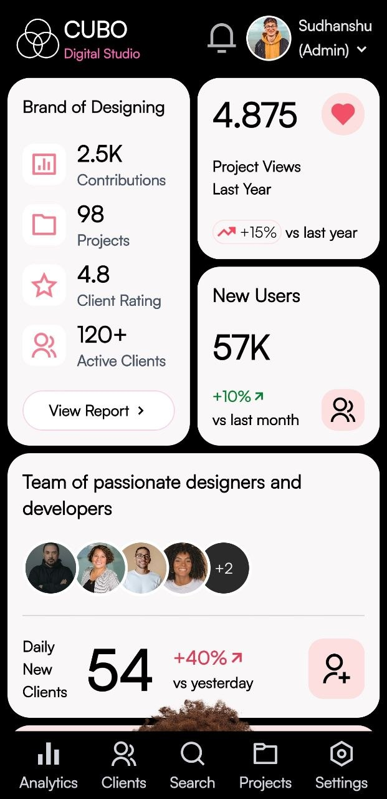
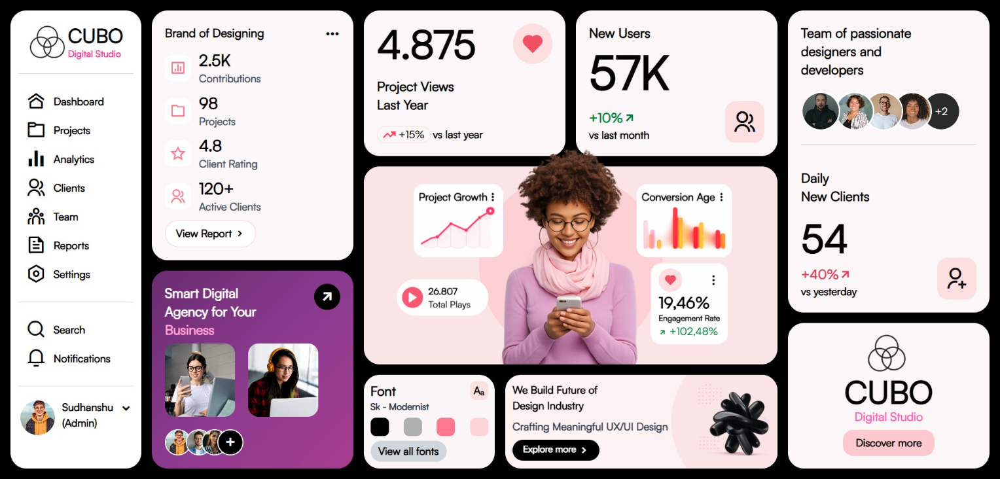
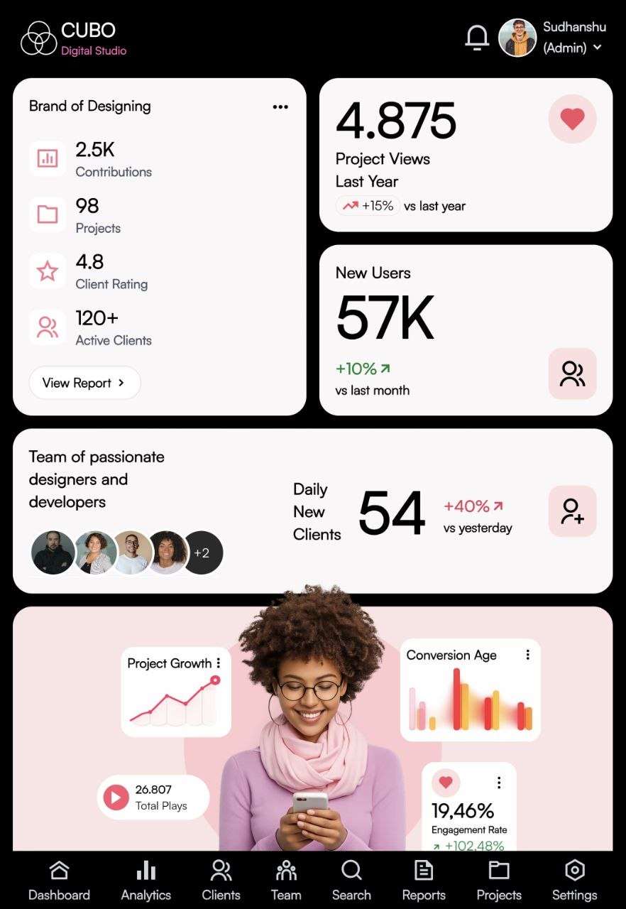
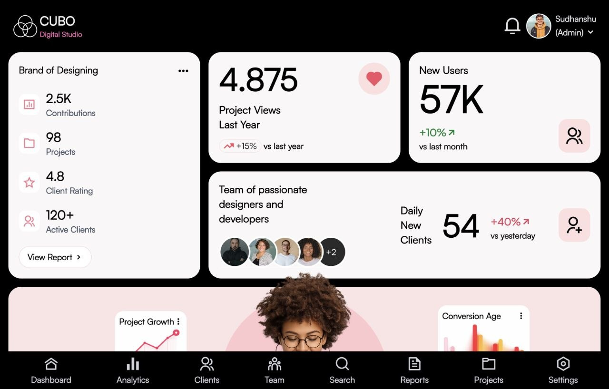

# Tailwind CUBO Digital Studio 🎨

A modern and responsive digital agency dashboard built with HTML5 and Tailwind CSS. The project focuses on responsive layouts, dashboard components, analytics cards, and clean UI design across mobile, tablet, and desktop devices.

## 🔗 Live Demo

https://tailwind-cubo-digital-studio-sudhanshu.vercel.app/

## 💻 Preview

* Desktop & Mobile

  
  

* Tablet Views

  
  

## ✨ Features

* Fully Responsive Design
* Modern Digital Agency Dashboard
* Analytics & Statistics Cards
* Team & Client Management Sections
* Desktop Sidebar Navigation
* Mobile Bottom Navigation
* Progressive Web App (PWA) Support
* Clean Grid-Based Layout

## 🛠️ Tech Stack

* HTML5
* Tailwind CSS
* Remix Icons

## 📚 Skills Demonstrated

* Responsive Web Design
* CSS Grid & Flexbox
* Tailwind CSS
* Component-Based UI Development
* Mobile-First Design
* Dashboard Layout Design

## 👨‍💻 Author

**Sudhanshu Shukla**

GitHub: https://github.com/ersudhanshushukla
